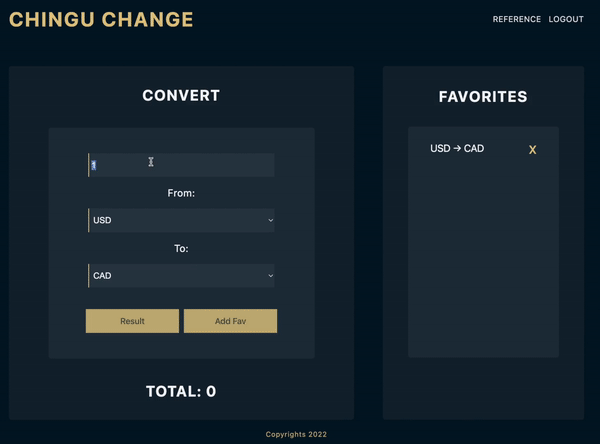
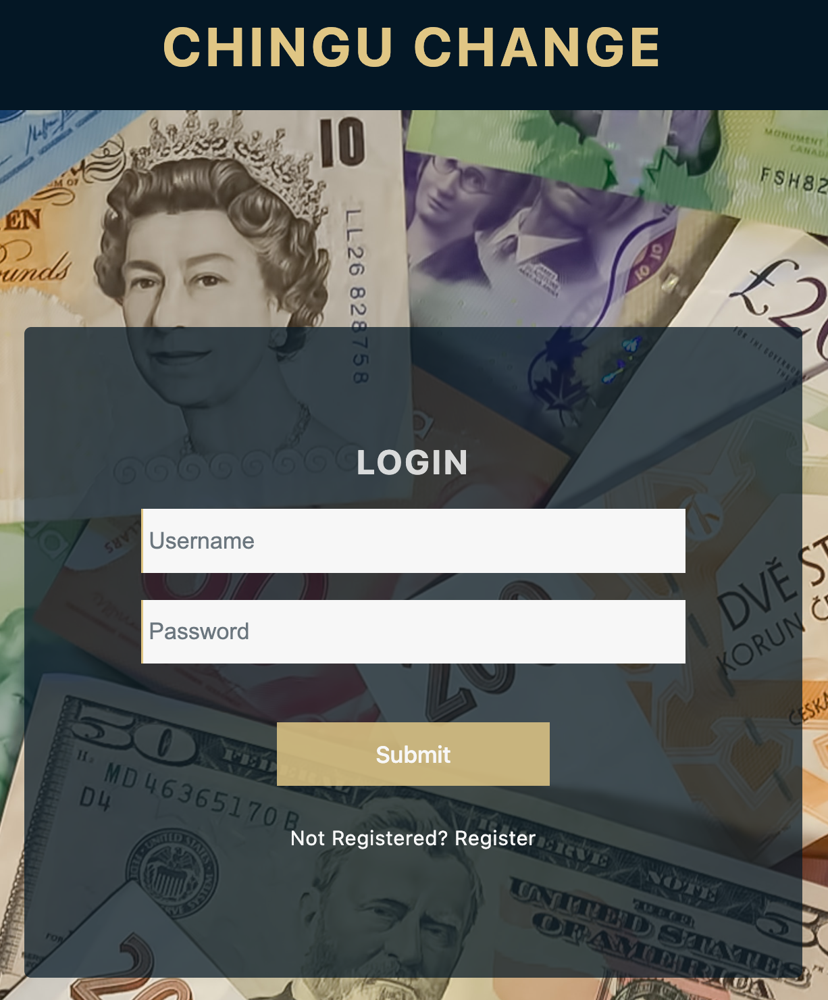
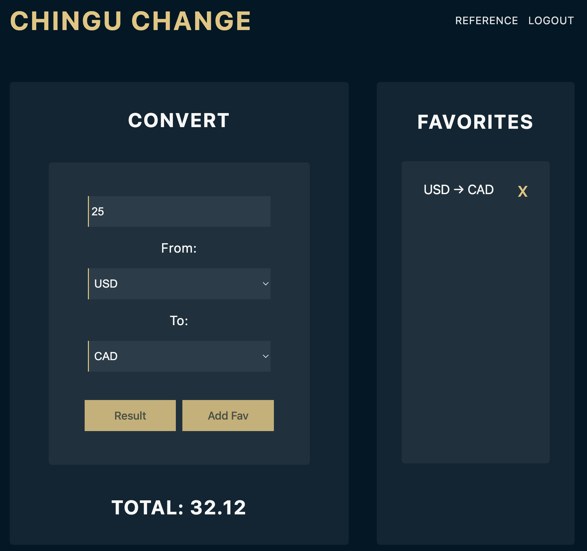

# Chingu-Change

This is a currency conversion application where a registered user can convert a specified amount across all currencies. They also have the ability to save and delete their favorite conversions.

> Project developed in a pair-programming session arranged by the Chingu.io team

## Table of contents

- [Overview](#overview)
  - [The Goal](#the-goal)
  - [Screenshots](#screenshots)
  - [Links](#links)
- [Our Process](#our-process)
  - [Built With](#built-with)
  - [Session Logs](#session-logs)
    - [Session 1](#session-1)
    - [Session 2](#session-2)
    - [Session 3](#session-3)
- [Contributors](#contributors)
- [License](#license)

## Overview

### The Goal

The goal was to build a currency converter application where registered users can conveniently convert currencies using an accessible interface.

### Screenshots

### Links

- GitHub: [github.com/medic1111/chingu-change](https://github.com/Medic1111/CHINGU-CHANGE)
- Live Site: [chingu-change.herokuapp.com/](https://chingu-change.herokuapp.com/)

## Our Process

### Built With

- Frontend
  - React.js
- Backend
  - Node.js
  - Express
  - Jest
- DB
  - MongoDB
- Tech
  - Discord
  - VS Code live-share extension
  - git/Github

### Session Logs

#### Session 1:

- Duration: 2:00
- Objectives:
  - [x] Choose project
  - [x] Determine MVP features
  - [x] Plan Session platforms
  - [x] Set a schedule
  - [x] Development of project structure
  - [x] Install all needed dependencies
  - [x] Development of server
  - [x] Rough blueprint of client
  - [x] Ensure client/server communication
  - [x] Request Third Party API key
  - [x] Ensure third party API communication with test key
  - [x] Test Client/Server relationship with third party API data
  - [x] Create DB with mutual dev access
- After Session
  - John: Create routes and handlers, Solidify server, build server Auth feature connected to DB
  - Gabbie: Build Client components

#### Session 2:

- Duration: 1:00
- Objectives:
  - [x] Code revision
  - [x] Determine status codes to be used
  - [x] Determine error handling
  - [x] Bug fixes
  - [x] Revision of DB implementation
  - [x] Feature list accomplished
  - [x] Add extra features to be accomplished by next session
  - [x] Server and Client structure review
  - [x] Development version deployment
- After Session
  - John: Complete all routes and handlers, ensure DB connection to all needed routes along with functionality
  - Gabbie: Layout all API calls and ensure proper transfer of data, finish all Client components, useContext for _State_

#### Session 3:

- Duration: 1:00
- Objectives:
  - [x] Code revision
  - [x] Code clean up
  - [x] Local Manual Testing
  - [x] Dev Deployed Manual Testing
  - [x] UI-UX enhancing
  - [x] All wanted features accomplished
  - [x] Decide on final thoughts and actions
- After Session
  - John: Server Testing with JEST, Server folder structure, code review, Documentation
  - Gabbie: Finish UI/UX, Code review, Documentation, Production deployment

### Contributors

**:point_right: Aryse Tansy**
:e-mail: paganowebdev@gmail.com
:computer: [Portfolio](https://www.pagano.dev/)

**:point_right: John Malapit**
:e-mail: [contact@johnmal.dev](mailto:contact@johnmal.dev)
:computer: [Portfolio](https://www.johnmal.dev/)

### License

MIT License
Copyright (c) 2022 Aryse Gabrielle Pagano & John Malapit
